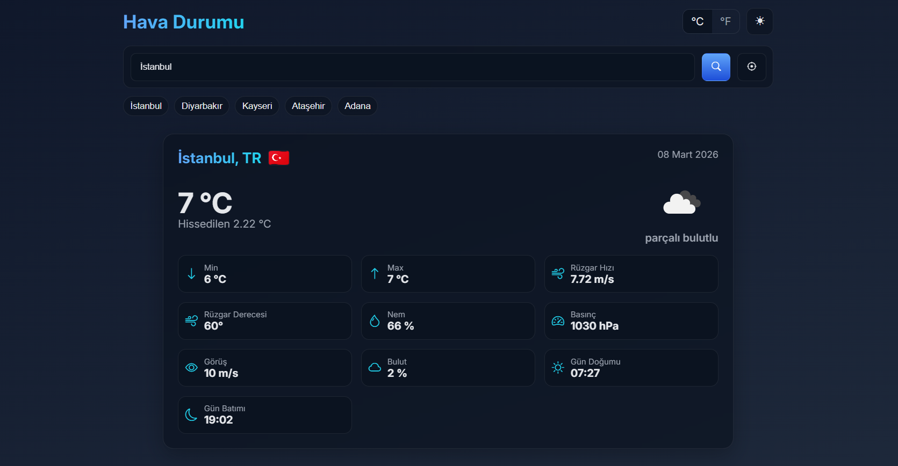
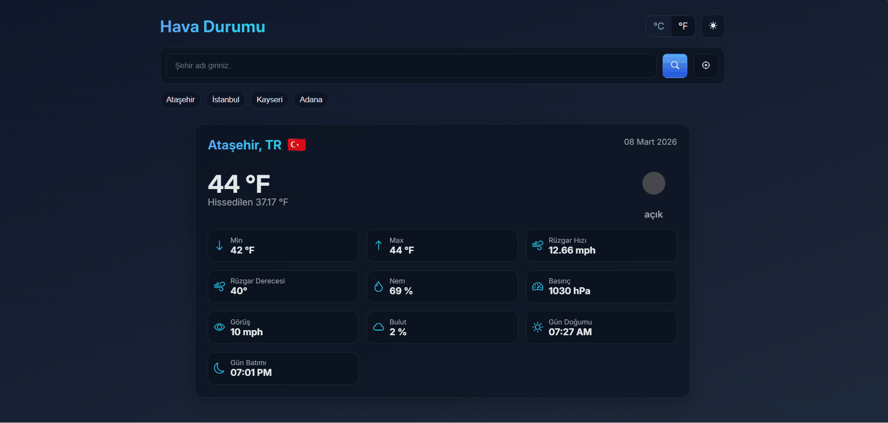

<h1 align="center">JS Modular Weather App</h1>

ES6 Modules kullanılarak geliştirilmiş,
geolocation destekli, theme ve unit yönetimine sahip
modern ve tamamen responsive <strong>Weather Application</strong> çalışmasıdır.

<h2>📌 Proje Amacı</h2>

Bu proje, herhangi bir framework kullanılmadan
modüler yapı prensipleri ile geliştirilmiştir.
API entegrasyonu, state yönetimi, localStorage kalıcılığı
ve temiz mimari üzerine pratik yapılmıştır.

<ul>
<li>📍 Geolocation ile konum bazlı hava durumu</li>
<li>🔎 Şehir arama sistemi</li>
<li>🕘 Son arananları saklama (LocalStorage)</li>
<li>🌗 Light / Dark tema desteği</li>
<li>🌡️ Metric / Imperial birim değiştirme</li>
<li>☁️ Dinamik hava durumu ikonları</li>
<li>⚡ Modüler dosya yapısı</li>
<li>📦 API entegrasyonu (OpenWeather)</li>
</ul>

<h2>🛠 Kullanılan Teknolojiler</h2>

<ul>
<li>HTML5</li>
<li>CSS3 (Flexbox & Grid)</li>
<li>JavaScript (ES6 Modules)</li>
<li>OpenWeather API</li>
<li>Geolocation API</li>
<li>LocalStorage API</li>
<li>Responsive Design</li>
</ul>

 

 </img>
  

<h2>Animasyon</h2>

</img>

